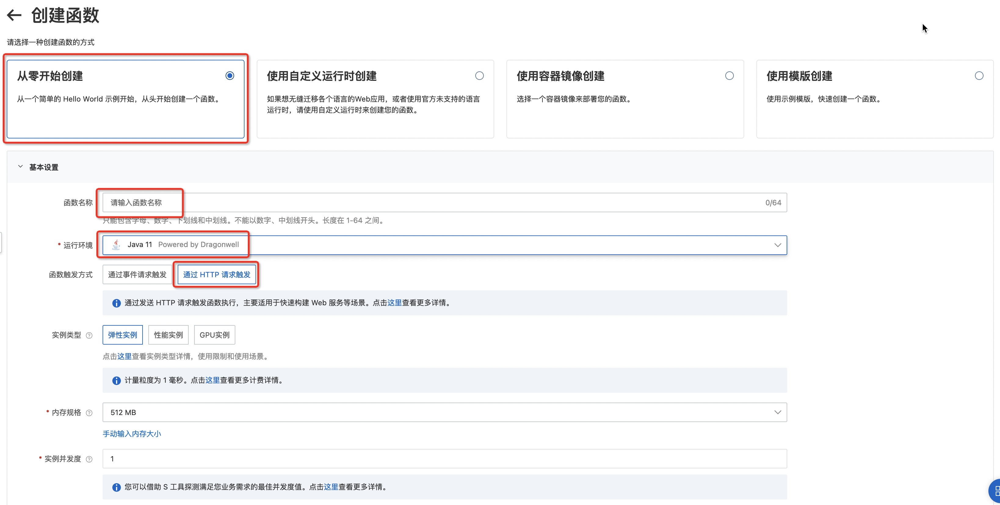
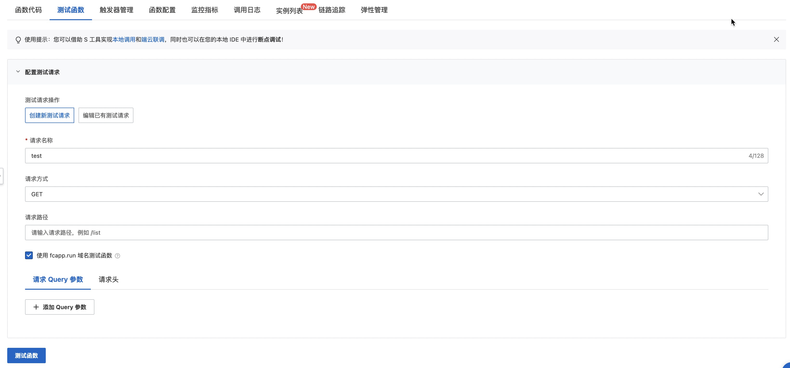

# esign 对接程序部署安装说明

本代码对接了esignv3 api并提供简易API供其他产品使用

## 准备开始

- [可选] 安装并配置 Serverless Devs 工具。（https://help.aliyun.com/document_detail/195474.html）

## 快速开始

### 方式一、使用 Serverless Devs 工具编译部署

#### 1. 修改 s.yaml 配置

- 根据需要修改 access 配置
- 根据需要修改 customDomain 自定义域名配置

> 注意：如果 domainName 设置为 auto，系统会默认分配测试域名，该域名仅供测试使用，不对其稳定性等做保证
> 详细信息见：https://www.serverless-devs.com/fc/yaml/customDomains

#### 2. 安装依赖并部署

编译部署代码包

```shell
s deploy
```

> 注意: `pom.xml` 中有配置 `pre-deploy` 脚本 `mvn package`, 在部署前会调用 `mvn package` 编译打包。

#### 3. 调用测试

3.1. 使用 `s invoke` 测试

```shell
s invoke
```

调用函数时收到的响应如下所示(实际IP信息已隐藏)：

```bash
Request url: http://xxxxxxxx.cn-hangzhou.fc.aliyuncs.com/2016-08-15/proxy/fc-esignservice/java11-blank-http/
========= FC invoke Logs begin =========
FC Invoke Start RequestId: c0eb0603-4c24-4072-a773-xxxxxxxx
FC Invoke End RequestId: c0eb0603-4c24-4072-a773-xxxxxxxx

Duration: 412.83 ms, Billed Duration: 413 ms, Memory Size: 128 MB, Max Memory Used: 100.89 MB
========= FC invoke Logs end =========

FC Invoke Result[Code: 200]:
Path: 
 Uri: /2016-08-15/proxy/fc-esignservice/java11-blank-http/
 IP: xx.xx.xx.xx
```

3.2. 使用自定义域名测试
可直接使用curl测试，或者使用API测试工具（如postman）

```bash
# 注意：将 {FunctionName}，{ServiceName}和{AccountID} 替换成实际的配置
curl -H 'X-Fc-Log-Type: Tail' -i 'http://{FunctionName}.{ServiceName}.{AccountID}.cn-hangzhou.fc.devsapp.net'
```

收到响应如下所示(实际IP信息已隐藏)

```bash
HTTP/1.1 200 OK
Access-Control-Expose-Headers: Date,x-fc-request-id,x-fc-error-type,x-fc-code-checksum,x-fc-invocation-duration,x-fc-max-memory-usage,x-fc-log-result,x-fc-invocation-code-version
Content-Type: text/plain
Header1: value1
Header2: value2
X-Fc-Code-Checksum: 1786997735xxxxxxxx
X-Fc-Instance-Id: c-624fd56e-xxxxxxxxxx
X-Fc-Invocation-Duration: 4
X-Fc-Invocation-Service-Version: LATEST
X-Fc-Log-Result: RkMgSW52b2tlIFN0YXJ0IFJlcXVlc3RJZDogYzViYzI3MGUtMjI1OC00Y2FkLThmMWEtOTlmY2YxNjBkMzRhCkZDIEludm9rZSBFbmQgUmVxdWVzdElkOiBjNWJjMjcwZS0yMjU4LTRjYWQtOGYxYS05OWZjZjE2MGQzNGEKCkR1cmF0aW9uOiAzLjg3IG1zLCBCaWxsZWQgRHVyYXRpb246IDQgbXMsIE1lbW9yeSBTaXplOiAxMjggTUIsIE1heCBNZW1vcnkgVXNlZDogMTAwLjI2IE1C
X-Fc-Max-Memory-Usage: 100.26
X-Fc-Request-Id: c5bc270e-2258-4cad-8f1a-99fcf160d34a
Date: Fri, 08 Apr 2022 06:28:49 GMT
Content-Length: 34

Path: 
 Uri: /
 IP: xxx.xxx.xxx.xxx
```

返回Header中的 `X-Fc-Log-Result` 是base64编码的日志，可以在命令下使用`base64`解码

```bash
$ echo RkMgSW52b2tlIFN0YXJ0IFJlcXVlc3RJZDogYzViYzI3MGUtMjI1OC00Y2FkLThmMWEtOTlmY2YxNjBkMzRhCkZDIEludm9rZSBFbmQgUmVxdWVzdElkOiBjNWJjMjcwZS0yMjU4LTRjYWQtOGYxYS05OWZjZjE2MGQzNGEKCkR1cmF0aW9uOiAzLjg3IG1zLCBCaWxsZWQgRHVyYXRpb246IDQgbXMsIE1lbW9yeSBTaXplOiAxMjggTUIsIE1heCBNZW1vcnkgVXNlZDogMTAwLjI2IE1C | base64 -d
```

可以看到以下输出：

```bash
FC Invoke Start RequestId: c5bc270e-2258-4cad-8f1a-99fcf160d34a
FC Invoke End RequestId: c5bc270e-2258-4cad-8f1a-99fcf160d34a

Duration: 3.87 ms, Billed Duration: 4 ms, Memory Size: 128 MB, Max Memory Used: 100.26 MB
```

### 方式二、使用控制台创建

#### 1. 编译打包

```shell
# 编译部署
mvn package
# 打包文件
cd target && zip -r java11-blank-http.zip *
```

#### 2. 创建函数

选择服务（或创建服务）后，单击创建函数，如图所示

- 选择 `从零开始创建`
- 填入函数名称
- 选择运行环境 java11/java8
- 选择函数触发方式：通过HTTP请求触发
- 其他设置使用默认



> 详细创建函数流程见文档: [使用控制台创建函数](https://help.aliyun.com/document_detail/51783.html)

#### 3. 配置测试参数

在函数管理页面的测试函数标签栏配置测试参数



#### 4. 测试函数

返回结果如下所示(实际IP信息已隐藏)

```bash
Path: 
 Uri: /2016-08-15/proxy/fc-esignservice.LATEST/java11-blank-http/
 IP: xxx.xxx.xxx.xxx
```